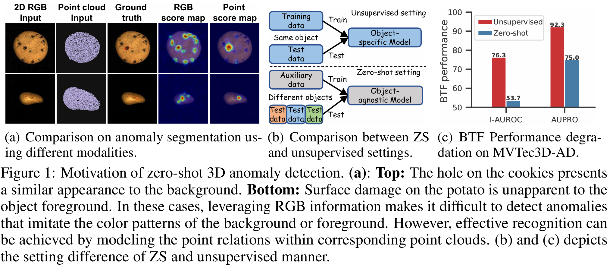
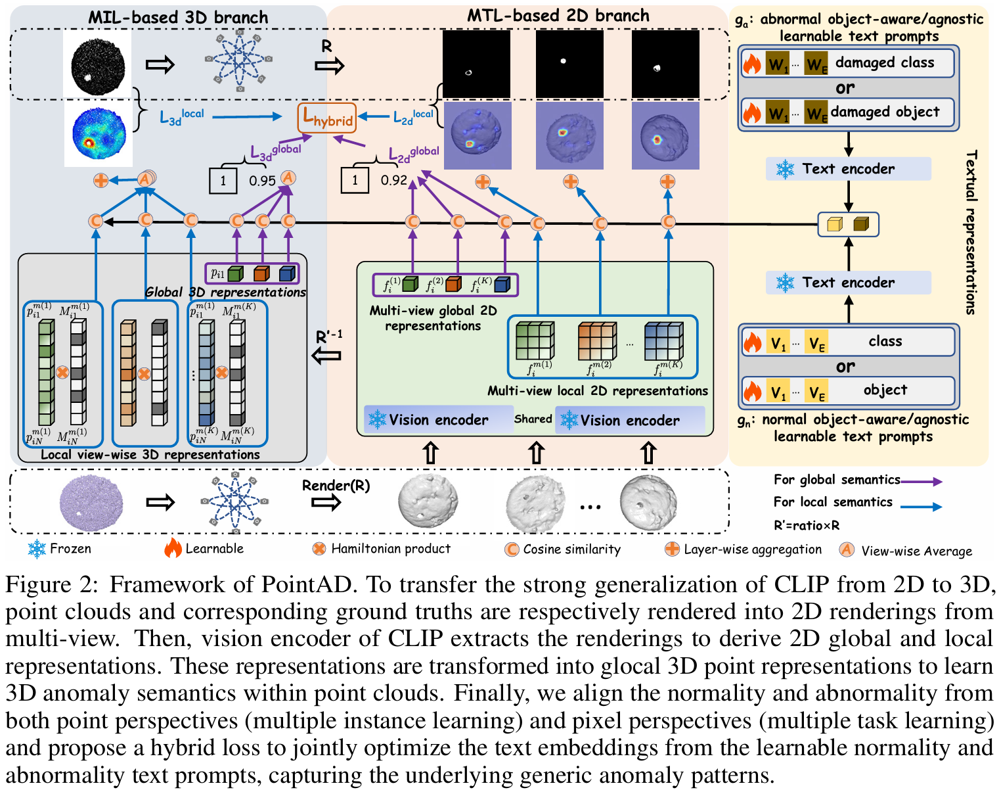
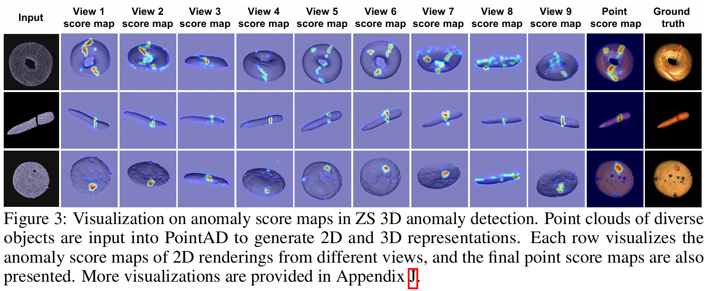
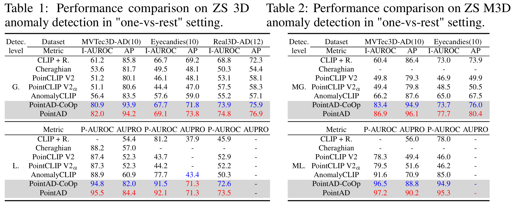
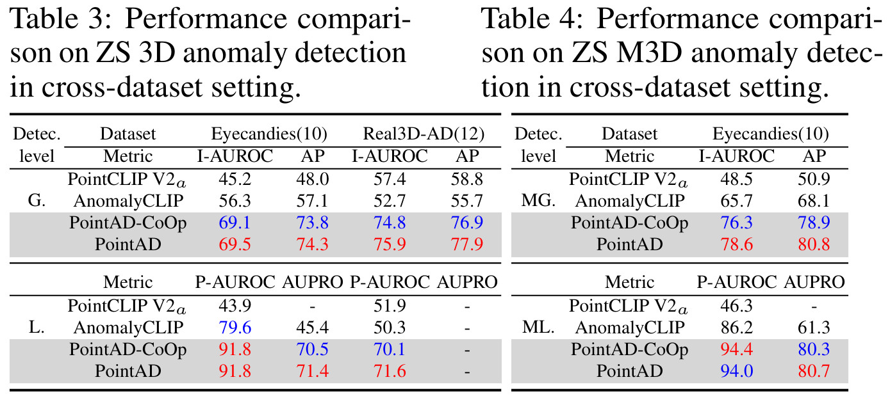
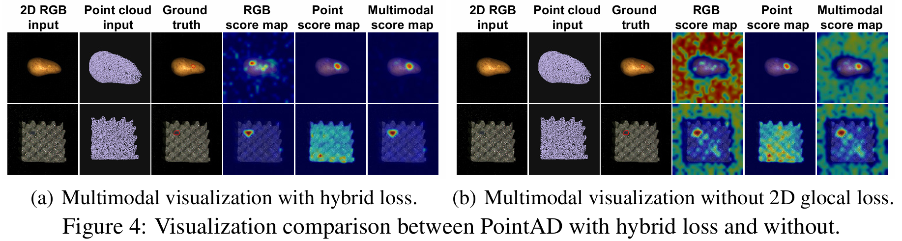
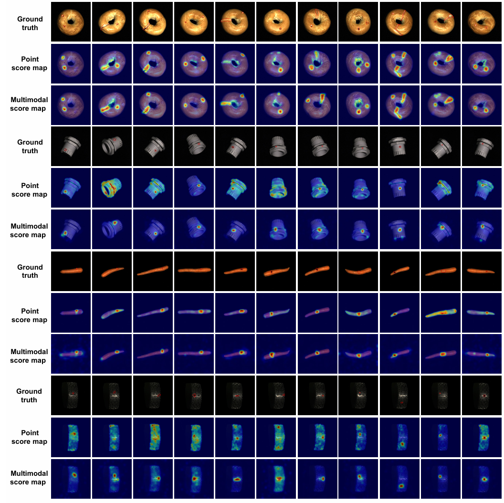

# PointAD （Detect point and multimodal 3D anomalies）
> [**NeurIPS 24**] [**PointAD: Comprehending 3D Anomalies from Points and Pixels for Zero-shot 3D Anomaly Detection**](https://arxiv.org/pdf/2310.18961.pdf)

## Introduction 
Zero-shot (ZS) 3D anomaly detection is a crucial yet unexplored field that addresses scenarios where target 3D training samples are unavailable due to practical concerns like privacy protection. This paper introduces PointAD, a novel approach that transfers the strong generalization capabilities of CLIP for recognizing 3D anomalies on unseen objects. PointAD provides a unified framework to comprehend 3D anomalies from both points and pixels. In this framework, PointAD renders 3D anomalies into multiple 2D renderings and projects them back into 3D space. To capture the generic anomaly semantics into PointAD, we propose hybrid representation learning that optimizes the learnable text prompts from 3D and 2D through auxiliary point clouds. The collaboration optimization between point and pixel representations jointly facilitates our model to grasp underlying 3D anomaly patterns, contributing to detecting and segmenting anomalies of unseen diverse 3D objects. Through the alignment of 3D and 2D space, our model can directly integrate RGB information, further enhancing the understanding of 3D anomalies in a plug-and-play manner. Extensive experiments show the superiority of PointAD in ZS 3D anomaly detection across diverse unseen objects.

## Motivation
 


## Overview of PointAD


## How to Run

### Prepare your dataset
Download the dataset below:


### Generate the dataset JSON


## Main results

> **We assume that only point cloud data is available during training. However, if corresponding RGB data is available during inference, PointAD directly integrates this information for multimodal detection.

 

### We evaluate PointAD in two zero-shot settings:

### (1) One-vs-Rest
We train PointAD on a single class from the dataset and test its performance on the remaining classes. To ensure completeness of the result, we train PointAD three times using three distinct classes and report the averaged detection and segmentation performance.**

 

### (2) Cross-Dataset: 
We train PointAD on one class on one class and test its performance on a completely different dataset with no overlap in class semantics.

 


## How multimodality makes PointAD accurate
 

## Visualization

 

* We thank for the code repository: [open_clip](https://github.com/mlfoundations/open_clip) and [AnomalyCLIP](https://github.com/zqhang/AnomalyCLIP/tree/master).

## BibTex Citation

If you find this paper and repository useful, please cite our paper.

```
@article{zhou2024pointad,
  title={PointAD: Comprehending 3D Anomalies from Points and Pixels for Zero-shot 3D Anomaly Detection},
  author={Zhou, Qihang and Yan, Jiangtao and He, Shibo and Meng, Wenchao and Chen, Jiming},
  journal={arXiv preprint arXiv:2410.00320},
  year={2024}
}
```
